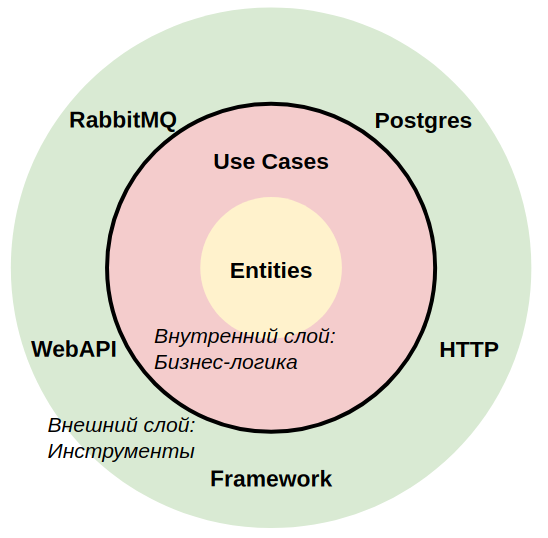

Шаблон сервиса на Go
===========================================
С развитием любого проекта, логика работы приложения усложняется и запутывается.
Разработка новых фич замедляется. Если не планировать архитектуру, довольно быстро
приходит время, когда переписать сервис становится дешевле, чем делать изменения в
существующем.

Цели:
1. Предоставить готовый шаблон для быстрого развертывания
2. Стандартизировать подходы к организации кода
3. Аккумулировать лучшие практики

Quick start
----
Локальная разработка:
```sh
# Postgres, RabbitMQ
$ make compose-up
# Run app with migrations
$ make run
```

Интеграционные тесты (можно запускать в ci):
```sh
# DB, app + migrations, integration tests
$ make compose-up-integration-test
```

Для работы RollBar установить переменные в .env:
```
ROLLBAR_ACCESS_TOKEN=<TOKEN>
ROLLBAR_ENVIRONMENT=<ENVIRONMENT>
```


Clean Architecture
----
### Главный принцип
Dependency Inversion (тот самый из SOLID) — принцип инверсии зависимостей, играет 
ключевую роль в построении архитектуры приложения. Чтобы принцип начал работать, 
нам нужно поделить приложение на слои.



Итак, приложение делится на 2 слоя, внутренний и внешний:
1. **Бизнес-логика** (стандартная библиотека Go).
2. **Инструменты** (база данных, HTTP сервер, брокер сообщений, любые другие пакеты 
   и фреймворки).

**Внутренний** слой с бизнес-логикой должен быть чистым, то есть:
* Не иметь в себе импортов пакетов из внешнего слоя.
* Не иметь в себе импортов любых других пакетов, кроме стандартной библиотеки.
* Делать обращения к внешнему слою через интерфейс(!).

Бизнес-логика ничего не знает о Postgres или RabbitMQ. Бизнес-логика знает
интерфейс для работы с _абстрактной_ базой данных, _абстрактным_ брокером
сообщений или _абстрактным_ HTTP сервером.

**Внешний** слой имеет другие ограничения:
* Все компоненты этого слоя не знают о существовании друг друга.
* Как из одного инструмента вызвать другой? Напрямую никак, только через 
  внутренний слой логики.
* Обращения к внутреннему слою происходят через интерфейс(!).
* Данные передаются в том формате, который удобен для бизнес-логики.

**Например**, вам нужно обратиться из http хендлера к базе данных. И http, и
БД находятся во внешнем слое, значит они ничего не знают друг о друге. Связь 
между ними осуществляется через бизнес-логику:
```
    Хендлер HTTP > Бизнес-логика
                   Бизнес-логика > База данных
                   Бизнес-логика < База данных
    Хендлер HTTP < Бизнес-логика
```  
Стрелочками > и < показано пересечение границ слоев с помощью Интерфейсов.

То же самое на картинке:


### Терминология по слоям
Во внутреннем слое:
* **Entities** — объекты, которыми оперирует бизнес-логика. В коде всегда называются 
по именам принятым в организации.
* **Use Cases** — бизнес-логика, манипулирующая внешним слоем через интерфейсы.

Во внешнем слое просто перечень пакетов, которые реализуют интерфейсы (чтобы 
бизнес-логика могла к ним обратится):
  * Postgres
  * HTTP
  * RabbitMQ
  * WebAPI
  * Framework
  * Любой другой package

### Дополнительные слои
На самом здесь представлен упрощённый, адаптированный под микросервисы, вариант 
Clean Architecture. Классический вариант [Clean Architecture](https://blog.cleancoder.com/uncle-bob/2012/08/13/the-clean-architecture.html)
разрабатывался для построения больших монолитных приложений и имеет 4 слоя абстракций.

То есть, в оригинальной версии, внешний слой делится ещё на два, которые
так же имеют обратную инверсию зависимостей друг к другу (направленную во внутрь)
и общаются через интерфейсы.

Внутренний слой так же делится на два (с разделением интерфейсов), в случае
сложной логики.
_______________________________

В нашей схеме мы оставляем во внутреннем круге 2 слоя (entity и usecase), потому
что это совпадает со структурой папок проекта. Но это очень тонкий слой, без 
интерфейсов.

Сложные инструменты из внешнего слоя рекомендуется делить на дополнительные 
слои абстракции. Мы призываем руководствоваться здравым смыслом и добавлять слои 
лишь в том случае, если это действительно необходимо.

### Альтернативные подходы
Кроме Чистой архитектуры есть очень близкие по духу — Луковая архитектура и 
Гексагональная (Порты и адаптеры). В основе всех подходов лежит базовый принцип 
инверсии зависимостей. Все подходы преследуют цель уменьшить зацепление и 
разграничить ответственность.

Test Driven Design
------------------
Domain Driven Design
--------------------
12-factor app
-------------
Dependency Injection
--------------------

Полезные ссылки
---------------
* [The Clean Architecture](https://blog.cleancoder.com/uncle-bob/2012/08/13/the-clean-architecture.html)
* [Книга Чистая архитектура](https://www.ozon.ru/context/detail/id/144499396/)
* [12 факторов](https://12factor.net/ru/)
