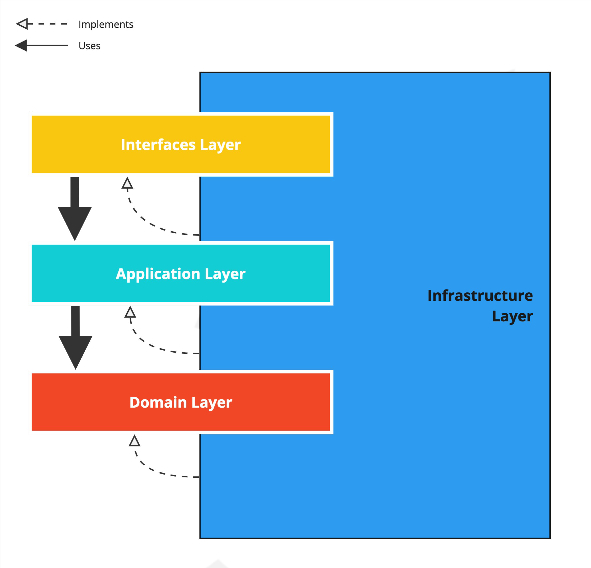

Domain Driven Design (DDD) Architecture template for Golang services

[](https://goreportcard.com/report/github.com/evrone/go-clean-template)
[](https://github.com/evrone/go-clean-template/blob/master/LICENSE)
[](https://github.com/evrone/go-clean-template/releases/)
[](https://codecov.io/gh/evrone/go-clean-template)

## Overview
The purpose of the template is to show:
- how to organize a project and prevent it from turning into spaghetti code
- where to store business logic so that it remains independent, clean, and extensible
- how not to lose control when a microservice grows

Using the principles of the DDD community highlighting contributes
from [Eric Evans](https://twitter.com/ericevans0)
and [Vaughn Vernon](https://twitter.com/VaughnVernon).
Their work has had a significant impact on the way that many software developers approach building
complex systems using DDD.

[Go-ddd-template](https://sebastiansigl.com) is created & supported
by [Sebastian Sigl](https://twitter.com/sesigl).

## Content
- [Quick start](#quick-start)
- [Libraries](#libraries)
- [Project structure](#project-structure)
- [Dependency Injection](#dependency-injection)
- [DDD Architecture](#clean-architecture)

## Quick start
Local development:
```sh
# Postgres, RabbitMQ
$ make compose-up
# Run app with migrations
$ make run
```

Integration tests (can be run in CI):

```sh
# DB, app + migrations, integration tests
$ make compose-up-integration-test
```

## Libraries

This template comes with a set of libraries to quickly get up to speed.

### GoLang httptest

[Httptest](https://pkg.go.dev/net/http/httptest) is a package within the Go programming language that enables
developers to test HTTP clients and servers more effectively. It provides utilities to create mock
HTTP servers and clients, simulating real-world scenarios for thorough testing.

The httptest package is leveraged to execute system-tests efficiently, which are located in close to
the main entry point, which is `app_test.go`.

## Project structure

### `cmd`

The `cmd` directory is used to structure the application's executable
binaries and their associated main functions. In the context of Domain-Driven Design (DDD), this
directory aids in maintaining a clear separation of concerns, ensuring that the business logic,
domain models, and infrastructure components remain decoupled from the application's entry points.

### `config`

The `config` directory stores environment-specific settings and non-sensitive data. Avoid storing
sensitive information like API keys or passwords within the source code or version control systems.
The `config` directory facilitates a clean architecture by decoupling configuration details
from domain logic. This approach allows developers to focus on the core business requirements.

First, `config.yml` is read, then environment variables overwrite the yaml config if they match.

The config structure is in the `config.go`. The `env-required: true` tag obliges you to specify a
value (either in yaml, or in environment
variables).

For configuration, we chose the [cleanenv](https://github.com/ilyakaznacheev/cleanenv) library.
It does not have many stars on GitHub, but is simple and meets all the requirements.

Reading the config from yaml contradicts the ideology of 12 factors, but in practice, it is more
convenient than
reading the entire config from ENV.
It is assumed that default values are in yaml, and security-sensitive variables are defined in ENV.

### `docs`

The `docs` folder serves as a dedicated storage location for Swagger
documentation generated by [swag](https://github.com/swaggo/swag). It contains auto-generated API
documentation files created by the Swag library, streamlining the development process and
eliminating the need for manual updates.

### `integration-test`

The `integration-test` folder is dedicated to housing integration tests, which
are executed in an isolated container alongside the application container. This setup facilitates
thorough testing of REST APIs through the use of the [go-hit](https://github.com/Eun/go-hit)
library, a powerful and user-friendly
testing tool.

### `internal/app`

There is always one _Run_ function in the `app.go` file, which "continues" the _main_ function.

This is where all the main objects are created.
Dependency injection occurs through the "New ..." constructors (see Dependency Injection).
This technique allows us to layer the application using
the [Dependency Injection](#dependency-injection) principle.
This makes the business logic independent from other layers.

Next, we start the server and wait for signals in _select_ for graceful completion.
If `app.go` starts to grow, you can split it into multiple files.

For a large number of injections, [wire](https://github.com/google/wire) can be used.

The `migrate.go` file is used for database auto migrations.
It is included if an argument with the _migrate_ tag is specified.
For example:

```sh
$ go run -tags migrate ./cmd/app
```

### `internal/interfaces`
Server handler layer (MVC controllers). The template shows 2 servers:
- RPC (RabbitMQ as transport, located in `internal/interfaces/rpc`)
- REST http (Gin framework, located in `internal/interfaces/rest`)

Server routers are written in the same style:
- Handlers are grouped by area of application (by a common basis)
- For each group, its own router structure is created, the methods of which process paths
- The structure of the business logic is injected into the router structure, which will be called by the handlers

Instead of Gin, you can use any other http framework or even the standard `net/http` library.

In `router.go` and its handler methods, there are comments for generating swagger documentation using [swag](https://github.com/swaggo/swag).

### `internal`

The `internal` folder houses non-sharable code, safeguarding critical components of an application.
It encompasses essential DDD (Domain-Driven Design) folders such as application, domain, and
interfaces, tailored to each specific application. This structure ensures both optimal organization
and robust security within high-scale software projects.

#### `internal/domain`

The `internal/domain` folder houses the crucial core domain code, serving as the foundation of our
application's logic. This isolated directory ensures minimal external dependencies, promoting code
integrity and maintainability. It is vital to the application, as it encompasses the essential logic
that drives core functionalities.

#### `internal/interfaces`

The `internal/interfaces` folder houses crucial code for processing various input sources, such as
CLI, REST APIs, and message-based systems. It standardizes data handling and streamlines integration
across different communication channels. In Hexagonal Architecture terms, these files serve
as incoming adapters, bridging external systems with the core application.

#### `internal/application`

The `internal/application` folder serves as a crucial bridge between external interfaces and
internal
domain and infrastructure components. It houses glue code that seamlessly integrates disparate
elements to streamline application functionality. This organization allows for efficient grouping of
related use cases within a single application service, enhancing maintainability and scalability

### `migrations`

The `migrations` folder in Golang projects houses essential database migration files, facilitating
schema updates and version control. These files contain SQL statements for creating, altering, or
dropping tables and columns, allowing developers to synchronize database structure across
environments. The migration process ensures consistent application behavior while reducing the risk
of data corruption and enhancing collaboration among team members.

### `pkg`

The `pkg` folder in Golang projects is a common convention for organizing shared code, often
implementing
to interfaces from the core domain. This structure promotes clean separation of concerns and
facilitates code reusability across multiple services or applications.

## Dependency Injection

In order to remove the dependence of business logic on external packages, dependency injection is
used.

For example, through the New constructor, we inject the dependency into the structure of the
business logic.
This makes the business logic independent (and portable).
We can override the implementation of the interface without making changes to the `usecase` package.

```go
package usecase

import (
// Nothing!
)

type Repository interface {
  Get()
}

type UseCase struct {
  repo Repository
}

func New(r Repository) *UseCase {
  return &UseCase{
    repo: r,
  }
}

func (uc *UseCase) Do() {
  uc.repo.Get()
}
```

It will also allow us to do auto-generation of mocks (for example
with [mockery](https://github.com/vektra/mockery)) and easily write unit tests.

> We are not tied to specific implementations in order to always be able to change one component to
> another.
> If the new component implements the interface, nothing needs to be changed in the business logic.

To manage the effort and complexity to instantiate and inject
dependencies, [wire](https://github.com/google/wire) is used to generate factories
at build-time.

## DDD Architecture

### Key idea

Programmers realize the optimal architecture for an application after most of the code has been
written.

> A good architecture allows decisions to be delayed to as late as possible.

### The main principle

Dependency Inversion (the same one from SOLID) is the principle of dependency inversion.
The direction of dependencies goes from the outer non-domain layers to the inner domain layer.
Due to this, business logic and entities remain independent from other parts of the system.

You might know this from clean architecture or onion-architecture already.


The foundation of onion architecture and ddd is similar: both manage dependencies to put the domain
logic in the center. Domain-driven-design contains much more guidance but on a package level, it's
only about 4 layers:



We put business logic into the Domain layer, and wrap it with an Application layer, each with
distinct functions:

1. Domain Layer: Executes the fundamental, use-case agnostic business logic within the
   domain/system.
2. Application Layer: Carries out application-specific use cases and contains IO heavy operations
   like fetching and storing data. It should contain as less logic as possible and acts as the glue
   between incoming access and the actual domain code to avoid domain leakage to outer layers.
3. Interfaces Layer: Comprises UI components, REST-Controller, message-receivers and others incoming
   sources for the application.
4. Infrastructure Layer: Bolsters other layers by implementing abstractions and integrating
   third-party libraries and systems.

Access flow starts from interfaces (e.g. REST), which access application services that are a facade
for a specific group of use cases. The application service is a great place to handle transactions,
logging, and other pure technical requirements. To keep it as free from domain logic as possible, a
typical method fetches an entity, calls an operation on it, or via another service, and stores it.

The infrastructure layer does its work behind the scenes. If there is a repository that gets the
data, the interface for the repository is located in the domain package because the domain requires
it to operate. The implementation is located in infrastructure because from a domain point of view,
it's not important how the data is fetched or stored. It's a detail that is abstracted away, which
comes with a lot of benefits like testability and portability.

It's not always beneficial to create an interface in the domain and implement it in infrastructure.
Sometimes, you just don't want to pollute the domain with something specific like monitoring. Hence,
you may want to put the interface in the application layer.

For example, let's go through an example for access to the database from a REST controller.

The REST-Controller is part of the outer incoming interfaces layer. The database is part of
infrastructure, which means they know nothing about each other.

The communication between them is carried out through use-case specific methods of the application
service:

```
    REST > ApplicationService
           ApplicationService > repository (Postgres)
           ApplicationService < repository (Postgres)
    REST < ApplicationService
```

The symbols > and < show the intersection of layer boundaries through Interfaces.

Or more complex business logic:

```
    REST > ApplicationService
           ApplicationService > repository
           ApplicationService < repository
           ApplicationService > webapi
           ApplicationService < webapi
           ApplicationService > RPC
           ApplicationService < RPC
           ApplicationService > repository
           ApplicationService < repository
    REST < ApplicationService
```

### Layers

### DDD Architecture Terminology

- **Domain**: A sphere of knowledge or activity that represents the business or system being
  modeled. It includes core concepts, business rules, and policies. Domain services and entities are
  located in the `internal/domain` folder.

- **Bounded Context**: A well-defined boundary within the domain, encapsulating a specific area of
  concern and its related elements, helping to avoid ambiguity and maintain consistency.

- **Ubiquitous Language**: A common language used by both technical and non-technical stakeholders
  to ensure clear communication and shared understanding of the domain concepts and requirements.

- **Entity**: A domain object with a unique identity that represents a business concept and persists
  over time, encapsulating both state and behavior.

- **Value Object**: An immutable domain object that represents a specific value or attribute, rather
  than a unique entity, and is defined by its properties.

- **Aggregate**: A cluster of domain objects (entities and value objects) that are treated as a
  single unit, ensuring consistency and enforcing business rules.

- **Aggregate Root**: The main entity within an aggregate that acts as a gateway for all
  interactions with the aggregate, managing its consistency and state.

- **Repository**: An abstraction that provides methods for retrieving, storing, and updating
  aggregates, decoupling the domain from the underlying data storage mechanism.

- **Domain Event**: A message or event that represents a significant occurrence within the domain,
  allowing for decoupled and reactive system design.

- **Domain Service**: A stateless service that encapsulates domain logic that doesn't naturally fit
  within an entity or value object, coordinating interactions between domain objects.

- **Application Service**: A service that coordinates the use of domain objects, repositories, and
  domain services to implement business use cases, acting as a bridge between the domain and the
  external world. Application Services are located in `internal/application`.

- **Infrastructure**: The technical components and services that support the domain, such as
  databases, messaging systems, and external API integrations. Implementations are located
  in `internal/infrastructure`.

### Interface-Type

Maintaining interface-types between the domain layer and infrastructure is crucial for inverting
dependencies, which is especially beneficial in GoLang for preventing circular dependencies.
Interface-types also enhance extensibility, adhering to the Open-Close principle, and improve testability
by simplifying dependency stubbing. While interface-types between all layers add value, they also
introduce additional code to maintain and increase complexity to comprehend.

### Alternative approaches

In addition to DDD architecture, _Onion architecture_,  _Hexagonal_ (_Ports and adapters_) or _Clean_ architecture are
similar to it. All are based on the principle of Dependency Inversion and separating and avoid dependencies to the business logic.

## Similar projects

- [https://github.com/bxcodec/go-clean-arch](https://github.com/bxcodec/go-clean-arch)
- [https://github.com/zhashkevych/courses-backend](https://github.com/zhashkevych/courses-backend)
- [https://github.com/evrone/go-clean-template](https://github.com/evrone/go-clean-template)

## Useful links

- [Twelve factors](https://12factor.net/)
