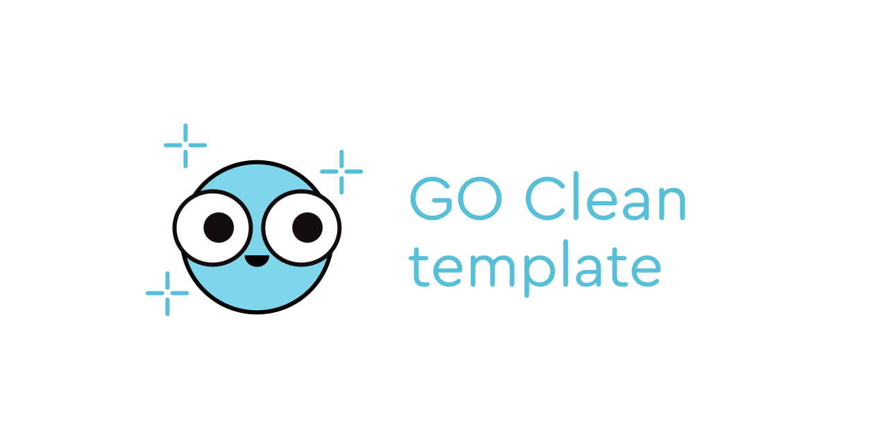
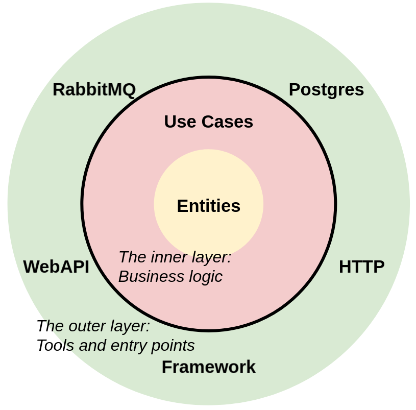
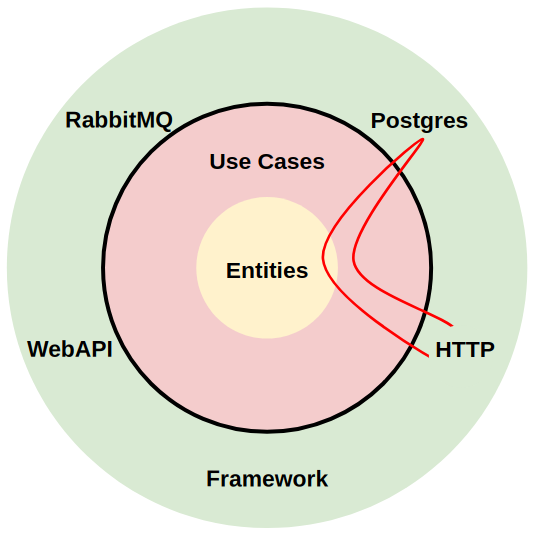
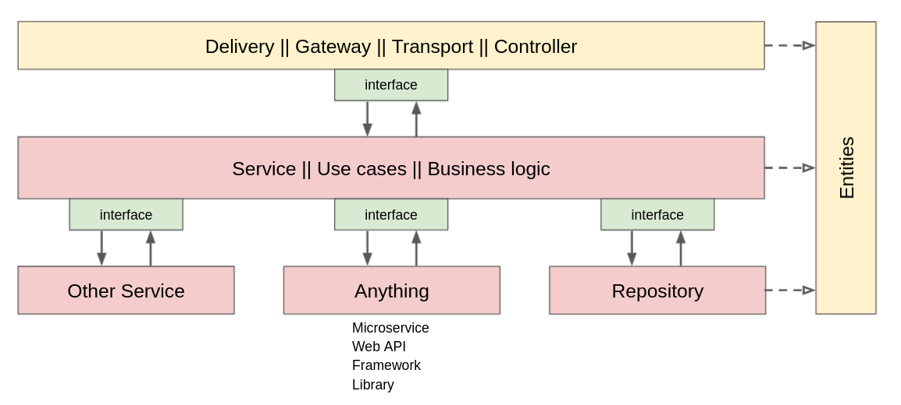

# Go 整洁模板

golang服务的整洁架构模板

[](https://goreportcard.com/report/github.com/evrone/go-clean-template)
[](https://github.com/evrone/go-clean-template/blob/master/LICENSE)
[](https://github.com/evrone/go-clean-template/releases/)
[](https://codecov.io/gh/evrone/go-clean-template)

## 综述
模板的目的为了展示：
- 如何组织项目，以防止项目演化成难以维护的代码
- 在哪里处理业务逻辑，以维护代码的独立、清晰和可扩展
- 当微服务增长时，不要失去控制

使用了  Robert Martin 的原则

[Go 整洁模板](https://evrone.com/go-clean-template?utm_source=github&utm_campaign=go-clean-template) 由 创建和提供支持[Evrone](https://evrone.com/?utm_source=github&utm_campaign=go-clean-template).

## 内容
- [快速开始](#快速开始)
- [工程架构](#工程架构)
- [依赖注入](#依赖注入)
- [整洁架构](#整洁架构)

## 快速开始
本地开发
```sh
# Postgres, RabbitMQ
$ make compose-up
# Run app with migrations
$ make run
```

集成测试（可以在CI中运行）
```sh
# DB, app + migrations, integration tests
$ make compose-up-integration-test
```
## Quick start
Local development:
```sh
# Postgres, RabbitMQ
$ make compose-up
# Run app with migrations
$ make run
```


## 工程架构
### `cmd/app/main.go`
配置和日志能力初始化。主要的功能在 `internal/app/app.go` 

### `config`
配置，首先读取 `config.yml`中的内容，如果环境变量里面有符合的变量，将其覆盖yml中的配置
配置的结构在 `config.go`中
`env-required:true` 标签强制你指定值（在yml文件或者环境变量中）

对于配置，我们选择[cleanenv](https://github.com/ilyakaznacheev/cleanenv) 库
cleanenv没有很多的starts数，但是它简单并能满足我们的需求
从yaml配置文件中读取配置违背了12种原则。但是比起从环境变量种读取所有的配置，它确实是更加方便的。
这种模式假设配置默认值在yaml文件种，对安全敏感的配置在环境变量种

### `docs`
Swagger 文档。由  [swag](https://github.com/swaggo/swag) 库自动生成
你不需要自己修改任何内容

### `integration-test`
集成测试
它会在应用容器旁启动独立的容器
使用[go-hit](https://github.com/Eun/go-hit) 会很方便的测试Rest API

## `internal/app`
这里只有通常只有一个 _Run_ 函数在 `app.go` 文件种。它是 _main_ 函数的延续

主要的对象在这里生成
依赖注入通过 "New ..." 构造 (阅读依赖注入)，这个技术允许使用[依赖注入](#依赖注入)的原则进行分层，使得业务逻辑独立于其他层。

接下来，我们启动服务器并阻塞等待_select_ 中的信号正常完成。

如果 `app.go`的规模增长了，你可以将它拆分为多个文件.

对于大量的依赖，可以使用[wire](https://github.com/google/wire)

`migrate.go` 文件用于是数据库自动构建
它显示的包扣了 _migrate_ 标签
```sh
$ go run -tags migrate ./cmd/app
```

### `internal/controller`
服务器处理层（MVC 控制层），这个模块展示两个服务
- RPC 
- REST http 

服务的路由用同样的风格进行编写
- handler 按照应用领域进行分组（又共同的基础）
- 对于每一个分组，创建自己的路由结构体和请求path路径
- 业务逻辑的结构被注入到路由器结构中，它将被处理程序调用

#### `internal/controller/http`
简单的 REST 版本控制
对于v2版本，我们需要添加`http/v2`文件夹，内容相同
在文件 `internal/app` 中添加以下行：
```go
handler := gin.New()
v1.NewRouter(handler, t)
v2.NewRouter(handler, t)
```
除了 Gin，您可以使用任何其他 http 框架，甚至是标准的 `net/http` 库。
在 `v1/router.go` 及以上的处理程序方法中，可以使用[swag](https://github.com/swaggo/swag) swagger 通过注释生成swagger文档.

### `internal/entity`
业务逻辑实体（模型）可用于任何层. 
这里包括一些方法，例如：参数检验.

### `internal/usecase`
业务逻辑.
- 方法按应用领域分组（在共同的基础上）
- 每个组都有自己的结构
- 一个文件对应一个结构
Repositories、webapi、rpc等业务逻辑结构被注入到业务逻辑结构中
(阅读 [依赖注入](#dependency-injection)).

#### `internal/usecase/repo`
是持久化存储的业务逻辑逻辑抽象,如数据库.

#### `internal/usecase/webapi`
是webapi业务逻辑使用的抽象.
例如，它可能是业务逻辑通过 REST API 访问的另一个微服务。
包名称根据业务的实际用途进行命名

### `pkg/rabbitmq`
RabbitMQ RPC 模式：
- RabbitMQ 中没有路由
- 使用Exchange fanout出并绑定 1 个独占队列，这么配置是最高效的
- 在连接丢失时重新连接

## 依赖注入
为了去除业务逻辑对外部包的依赖，使用了依赖注入.
例如，通过New构造函数，我们将依赖注入到业务逻辑的结构中.
这使得业务逻辑独立（且可移植）
我们可以覆盖接口的实现，而无需更改 `usecase` 包.

它还将允许我们自动生成相关mock（例如使用 [mockery](https://github.com/vektra/mockery)），以便进行单元测试.
> 我们不依赖于特定的实现，以便始终能够将一个组件更改为另一个组件
> 如果新组件实现了接口，则业务逻辑无需更改。
```go
package usecase

import (
    // Nothing!
)

type Repository interface {
    Get()
}

type UseCase struct {
    repo Repository
}

func New(r Repository) *UseCase{
    return &UseCase{
        repo: r,
    }
}

func (uc *UseCase) Do()  {
    uc.repo.Get()
}
```

## 整洁架构
## 关键的观点
在编写完大部分代码后，程序员会意识到应用程序的最佳架构

> 一个好的架构允许尽可能晚地做出决策

### 主要原则
依赖倒置的原理（与 SOLID 相同）
依赖的方向是从外层到内层。
因此，业务逻辑和实体可以保持独立于系统的其他部分。
因此，应用程序分为 2 层，内部和外部：
1. **业务逻辑**（Go标准库）
2.  **工具**（数据库、服务器、消息代理、任何其他包和框架）
  


**带有业务逻辑的内层**应该是干净的，它应该有如下特征：
- 没有从外层导入的包
- 仅使用标准库的功能
- 通过接口调用外层(!)

业务逻辑对 数据存储 或特定的 Web API 是无感知的.
业务逻辑用抽象接口处理 数据库或 web API。
**外层**有其他限制：
- 该层的所有组件都不知道彼此的存在。如何进行组件间的调用呢? 只能通过业务逻辑的内层间接调用
- 所有对内层的调用都是通过接口进行的(!)
- 为了便捷地进行业务数据传输，数据格式得进行标标准化（`internal/entity`）。

例如，您需要从 HTTP（控制器）访问数据库
HTTP 和数据库都在外层，这意味着他们彼此无法感知
它们之间的通信是通过`usecase`（业务逻辑）进行的：
```
    HTTP > usecase
           usecase > repository (repo)
           usecase < repository (repo)
    HTTP < usecase
```
符号 > 和 < 通过接口显示层边界的交集
如图所示


更加复杂的业务逻辑
```
    HTTP > usecase
           usecase > repository
           usecase < repository
           usecase > webapi
           usecase < webapi
           usecase > RPC
           usecase < RPC
           usecase > repository
           usecase < repository
    HTTP < usecase
```

### 层


### 整洁的架构相关术语
- **ENTITY**是业务逻辑运行的结构。
它们位于`internal/entity`文件夹中。
在 MVC 术语中，实体是models

- **Use Cases** 业务逻辑位于 `internal/usecase` 中
与业务逻辑直接交互的层通常称为_infrastructure_ 层
这些可以是存储库 `internal/usecase/repo`、外部 webapi `internal/usecase/webapi`、任何包和其他微服务。
在模板中，_infrastructure_ 包位于 `internal/usecase` 中

您可以根据需要决定你要调用的入口点，包括：
- controller 
- delivery
- transport
- gateways
- entrypoints
- primary
- input


### 附加层

[整洁架构](https://blog.cleancoder.com/uncle-bob/2012/08/13/the-clean-architecture.html) 的经典版本是为构建大型单体应用程序而设计的，有 4 层

原版中，外层多分为两层，也使用依赖倒置原理
彼此（向内）通过接口进行通信

在复杂逻辑的情况下，内层也分为两层（通过接口进行分层）
_______________________________
复杂的工具可以通过分层设计。切记只有在你有需要的时候菜进行分层

### 替代品
除了整洁的架构, _Onion architecture_ 和 _Hexagonal_ (接口适配层) 一样能达到目的，他们都符合依赖倒置的原则
这三种模式都非常接近，不同的知识术语不同

## 相似的工程
- [https://github.com/bxcodec/go-clean-arch](https://github.com/bxcodec/go-clean-arch)
- [https://github.com/zhashkevych/courses-backend](https://github.com/zhashkevych/courses-backend)

## 可能有用的链接
- [The Clean Architecture article](https://blog.cleancoder.com/uncle-bob/2012/08/13/the-clean-architecture.html)
- [Twelve factors](https://12factor.net/ru/)
